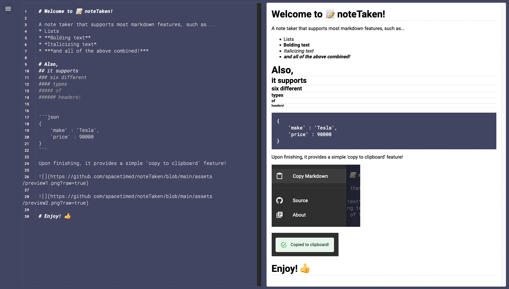

# noteTaken

A lightweight, minimalist **markdown note taker** for web browsers.

This project is meant to provide "quick note taking" with a markdown preview, offering an easy "copy to clipboard" option prior to departure.

## 📺  Demo

### [View a live demo at **https://note-taken.vercel.app/**](https://note-taken.vercel.app/)

 

## 🗂 Architecture
This project uses:
* React
* SASS / SCSS
* Material UI (MUI)
* Vercel hosting
* A custom written `CodeEditor` component

 

## ⚠️  Planned fixes
* Avoid using `dangerousSetInnerHtml`; find a better alternative
* **Bug fix:** Cursor location is incorrect if word wrap occurs in the code editor
* **Bug fix:** Cursor location is incorrect on mobile
* Responsiveness breaks under"extreme" resolutions (very small width resolutions)

 

## 🛠 Compatability
* As of **June 2022** - Expected to work in most modern browsers